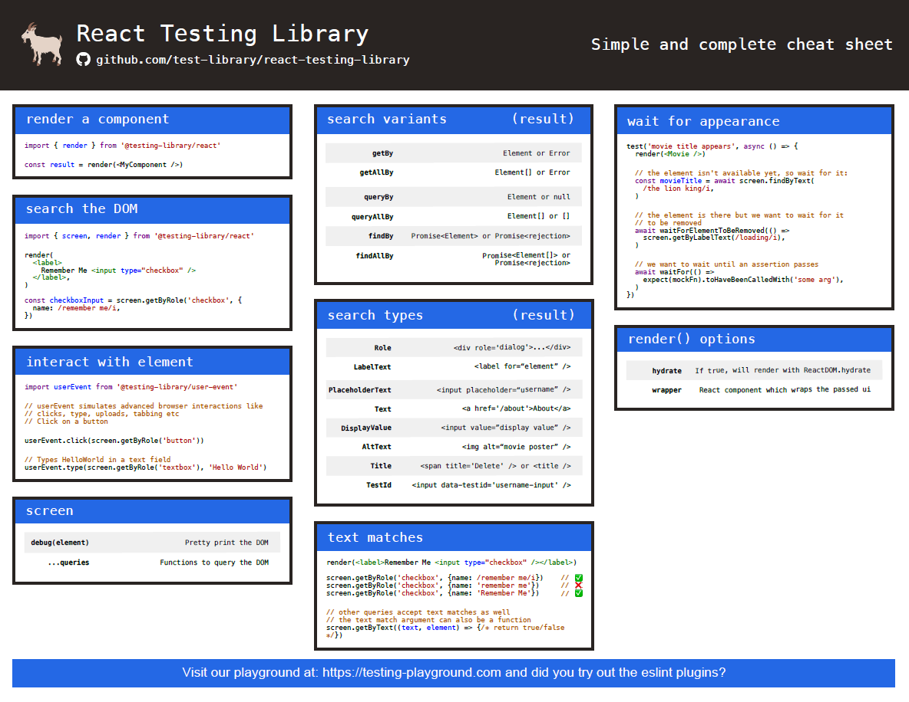

# Iniciando testes com Jest e React Testing Library

<!--  -->

## O Que Testar ??

- renders correctly
- component actions/functionalities/interactions
- component variants
- verify state
- Acessibility

## Padrão AAA

Siga o padrão AAA ( Arrange, Act, Assert ) para testar

- Renderizar o componente 						-		( render )
- Selecionar o elemento a ser testado			-		( screen + queries )
- Realizar a comparação / análise 				-		( expect )

# Search Variants
- get		|	Busca pelo elemento informado, caso não tenha, retorna erro
- query	|	Busca se o elemento informado existe, caso não exista, retorna null. OBS: É bom para testar se um elemento está ou não na tela, está ativo ou não.
- find	|	Busca uma promisse ou promisse reject

 
